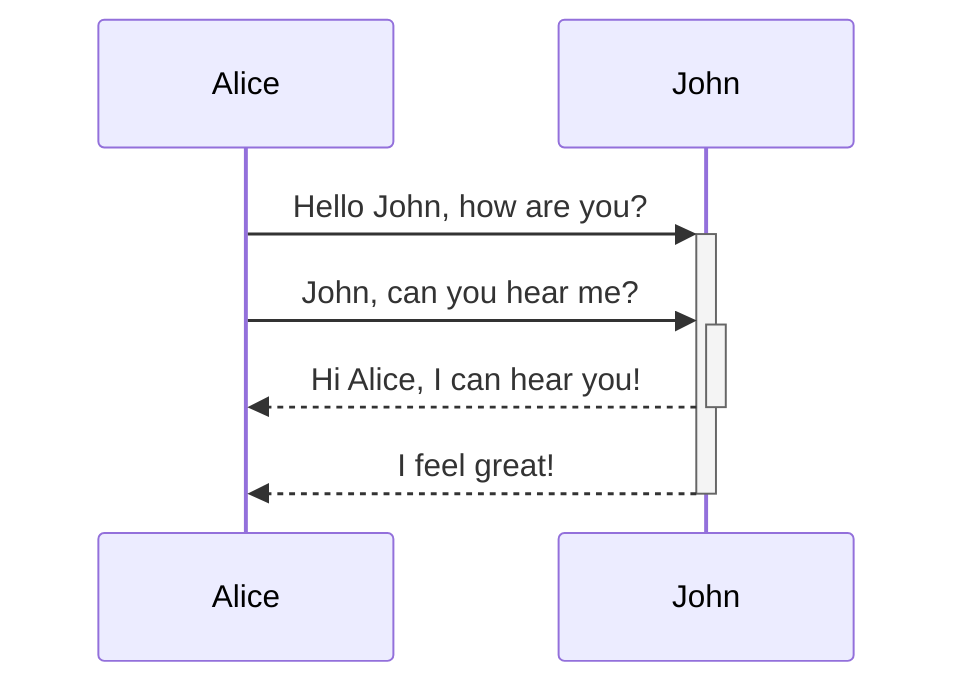
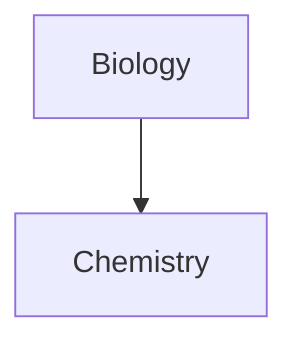

droidecahedron's md syntax cheatsheet for copy pasting around
I omitted obsidian specific stuff (which is able to do pathing on your computer, local file systems, have a vault, etc)

### Internal linking

```markdown
Link to a page: [[Internal link]].
```

### Embeds 

Embed another file (read more about [Embed files](https://help.obsidian.md/How+to/Embed+files)). Here's an embedded section:

```markdown
![[Obsidian#What is Obsidian]]
```


# Headings
---

> input

```md
# This is a heading 1
## This is a heading 2
### This is a heading 3
#### This is a heading 4
##### This is a heading 5
###### This is a heading 6

###### This is a horizontal line under a heading.
--- 
###### You can also use * and _
***
___
```

> output

# This is a heading 1
## This is a heading 2
### This is a heading 3
#### This is a heading 4
##### This is a heading 5
###### This is a heading 6

###### This is a horizontal line under a heading.
--- 
###### You can also use * and _
***
___


# Emphasis
---
> input

```markdown
*This text will be italic* 
_This will also be italic_


**This text will be bold**
__This will also be bold__
```

> output

*This text will be italic* 
_This will also be italic_


**This text will be bold**
__This will also be bold__


# Lists
---
#### Unnumbered Lists
> input

```markdown
- Item 1
- Item 2
	- Item 2a
	- Item 2b
```

> output

- Item 1
- Item 2
	- Item 2a
	- Item 2b

#### Numbered Lists (You can also prefix every list item with the same number (1.). These will show up as all 1 in edit mode, will show up as ordered in read mode/web viewers.)

> input

```markdown
1. Item 1 
2. Item 2 
3. Item 3 
	1. Item 3a
	2. Item 3b
```

> output

1. Item 1 
2. Item 2 
3. Item 3 
	1. Item 3a
	2. Item 3b

Create a _loose list_ by adding a blank line between any two list items.
> input

```markdown
- Item 1

- Item 2
- Item 3
```

> output

- Item 1

- Item 2
- Item 3

#### extra example
```markdown
100. First list item
     - First nested list item
     
       - Second nested list item
```
100. First list item
     - First nested list item
     
       - Second nested list item


# Images
---
> input

```markdown

```

> output


#### resizing images
example to 100 pixel wide
> input
```md

```
or local
```md
![[og-image.png|100]]
```

> output


# Links
---
#### External links

> input

```markdown
[@droidecahedron's GitHub](https://github.com/droidecahedron)
```

> output

[@droidecahedron's GitHub](https://github.com/droidecahedron)


# Blockquotes
---

> input

```markdown
> Shine boldly, so that all may find you when the night falls. 

\- Izaro Phrecius
```

> output

> Shine boldly, so that all may find you when the night falls. 

\- Izaro Phrecius


# Code
---
#### Inline Code

> input

```markdown
Text inside `backticks` on a line will be formatted like code.
```

> output

Text inside `backticks` on a line will be formatted like code.

#### Code Blocks
You may want to add syntax highlighter plugin to your md viewer to have it highlight correctly, if your language is not supported. (many cases, x86asm supported and avr not, etc.)
- example lang prefixes after the three `: py, c, cpp, js, md

> input

```md
```js
function fancyAlert(arg)
{ 
	if(arg)
	{ 
		$.facebox({div:'#foo'})
	}
} ```
```


> output

```js
function fancyAlert(arg)
{ 
	if(arg)
	{ 
		$.facebox({div:'#foo'})
	}
} ```

##### Text indented with a tab will also look like a code block in preview.
> input

```md
	Lorem ipsum dolor sit amet, consectetur adipiscing elit.
```

> output

	Lorem ipsum dolor sit amet, consectetur adipiscing elit.


# Task List
---

> input

```markdown
- [x] #tags, [links](), **formatting** supported
- [x] list syntax required (any unordered or ordered list supported)
- [x] this is a complete item
- [?] this is also a complete item (works with every character)
- [ ] this is an incomplete item
- [ ] tasks can be clicked in Preview to be checked off
```

> output

- [x] #tags, [links](), **formatting** supported
- [x] list syntax required (any unordered or ordered list supported)
- [x] this is a complete item
- [?] this is also a complete item (works with every character)
- [ ] this is an incomplete item
- [ ] tasks can be clicked in Preview to be checked off


# Tables
---
You can create tables by assembling a list of words and dividing the header from the content with hyphens, `-`, and then separating each column with a pipe `|`:
- Note: The vertical bars at start and end of line are optional.

> input

```markdown
|First Header | Second Header|
|------------ | ------------|
|Content from cell 1 | Content from cell 2|
|Content in the first column | Content in the second column|
|You can use links|and they will [work](https://github.com/tapco)|
```

> output

|First Header | Second Header|
|------------ | ------------|
|Content from cell 1 | Content from cell 2|
|Content in the first column | Content in the second column|
|You can use links|and they will [work](https://github.com/tapco)|

#### You can also justify your tables.
Example also using no start or terminating `|`

> input

```markdown
Tables can be justified with a colon | Another example with a long title | And another long title as a example
:----------------|-------------:|:-------------:
because of the `:` | these will be justified |this is centered
```

> output

Tables can be justified with a colon | Another example with a long title | And another long title as a example
:----------------|-------------:|:-------------:
because of the `:` | these will be justified |this is centered


# Highlighting
---

> input

```markdown
Use two equal signs to ==highlight text==.
```

> output

Use two equal signs to ==highlight text==.


# Footnotes
---
#### Pay attention to newlines here.

> input

```markdown
Here's a simple footnote,[^1] and here's a longer one.[^bignote]

[^1]: meaningful!
[^bignote]: Here's one with multiple paragraphs and code.
	
	Indent paragraphs to include them in the footnote. 
	
	`{ my code }`
	
	Add as many paragraphs as you like.
```

> output

Here's a simple footnote,[^1] and here's a longer one.[^bignote]

[^1]: meaningful!
[^bignote]: Here's one with multiple paragraphs and code.
	
	Indent paragraphs to include them in the footnote. 
	
	`{ my code }`
	
	Add as many paragraphs as you like.

#### You can also do inline footnotes.

> input

```markdown
You can also use inline footnotes. ^[notice that the caret goes outside of the brackets on this one.]
```

> output

You can also use inline footnotes. ^[notice that the caret goes outside of the brackets on this one.]


# Math
---
#### Relies on your destination for the markdown to have latex viewing.

> input

```markdown
$$\begin{vmatrix}a & b\\ c & d \end{vmatrix}=ad-bc$$
You can also do inline math like $e^{2i\pi} = 1$ .
```

> output

$$\begin{vmatrix}a & b\\ c & d \end{vmatrix}=ad-bc$$
You can also do inline math like $e^{2i\pi} = 1$ .


# Callouts
---
#### Your destination must support callouts.

> input

```markdown
> [!INFO]
>
> Here's a callout block.
> It supports **markdown** and [[Internal link|wikilinks]]
> and [external links](http://tapconet.com).
```

> output

> [!INFO]
>
> Here's a callout block.
> It supports **markdown** and [[Internal link|wikilinks]].
> and [external links](http://tapconet.com).


# Diagrams
---
#### Your destination must support mermaid or some equivalent

> input (change the last ' to a `)

```
```mermaid
sequenceDiagram
Alice->>+John: Hello John, how are you?
Alice->>+John: John, can you hear me?
John-->>-Alice: Hi Alice, I can hear you!
John-->>-Alice: I feel great!
``'

```mermaid
graph TD
Biology --> Chemistry
``'
```

> output






  

# Obsidian comment for template.
---
Template for the above sections below. It will not render in exports from obsidian.

%% template
# Title
---
#### subtitle
text

> input

```markdown
stuff
```

> output

stuff
%%
